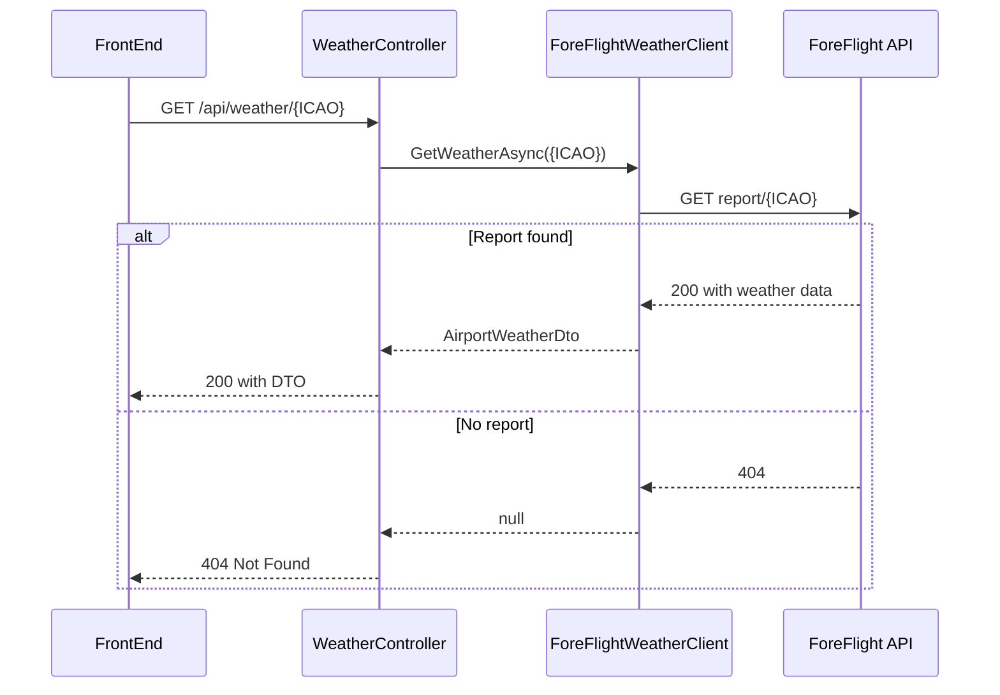
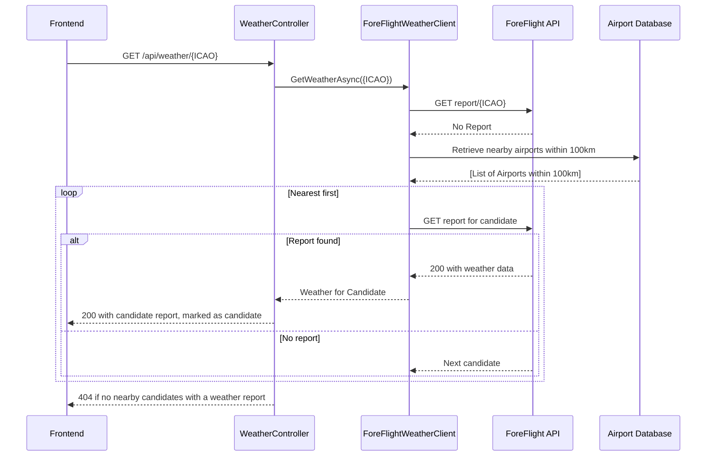

# Nearby Airport Spec

## Goal

In case of an aiport with no weather data available, we need to locate the closest nearby airport, so we can retrieve the closest possible weather for the given airport we are interested in the conditions of.

## Current Architecture

This is a sequence diagram of the flow today.
FrontEnd calls the backend with an ICAO code, and the backend either responds 200 with the DTO or 404 if no report at all is present for the airport. An airport can return a report but with no weather data.

## Proposed Solution

For a given airport with no weather data, we have access to the coordinates, and we also have a database of airports with coordinates. So we simply have to retrieve a list of nearby airports with available weather data, but we also need an upper boundary so we don't end up showing weather data for an airport several hundreds of kilometers away.

## Test Plan

Ensure proper tests of:
* Retrieval of nearby airports based on coordinates
* Distance calculation
* Sorting of candidates

## Definition of Done

When the end user looks up an airport with no weather data available, the system will ensure that nearby airports have been looked up, and if a proper candidate is available, a weather report will be shown.
